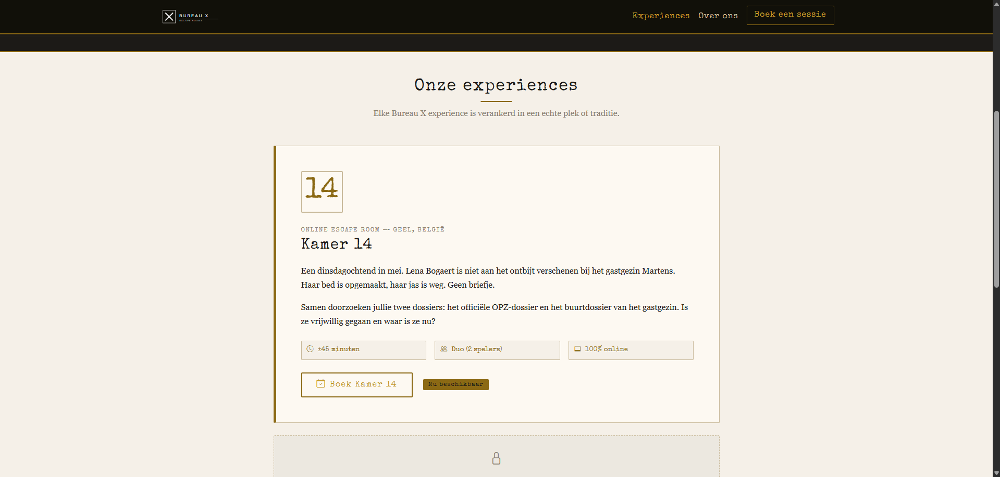
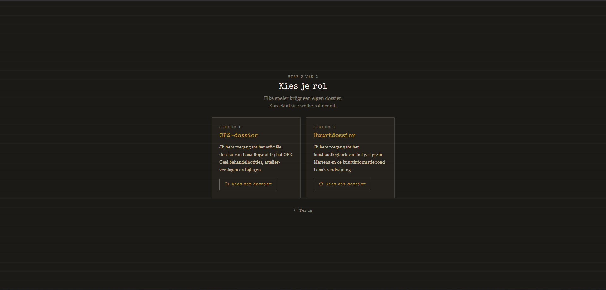

<div align="center">


<br />
<br />

<h1>Bureau X — Online Escape Experiences</h1>

<p>
Immersive browser-based escape room experiences designed as a digital alternative to traditional physical escape rooms.
</p>

<p>
<a href="https://bureau-x.be">

</a>

<a href="https://github.com/xandermeyen/Escape-room">

</a>

<a href="https://github.com/xandermeyen/Escape-room/blob/main/LICENSE">

</a>
</p>

</div>

---

# Overview

Bureau X is an online escape room platform focused on immersive digital experiences that can be played directly in the browser.

The project was created as an alternative to physical escape rooms, which often require large investments in construction, space, technology, and maintenance. By moving the experience online, Bureau X explores how atmosphere, storytelling, puzzles, and tension can still create a memorable escape room experience without physical limitations.

Each experience is designed around its own unique setting, narrative, mechanics, and puzzle structure.

The first online experience is currently live, while future experiences will introduce completely new themes, stories, and interactions.

---

# Concept

<div align="center">

| Traditional Escape Rooms | Bureau X Online Experiences |
|---|---|
| Physical construction required | Fully browser-based |
| High production and maintenance cost | Flexible and scalable |
| Limited by location | Accessible from anywhere |
| Difficult to rapidly iterate | Fast development and experimentation |
| One physical theme per room | Multiple digital experiences possible |

</div>

---

# Features

- Browser-based escape room experiences
- Story-driven progression
- Interactive puzzle systems
- Atmospheric UI and visual design
- Responsive experience for desktop devices
- Easily expandable platform for future experiences
- Modular structure for new themes and mechanics
- Fast deployment through GitHub Pages and custom hosting

---

# Vision

Bureau X is not intended to replace physical escape rooms.

Instead, the goal is to explore a different form of immersion:
a digital experience where storytelling, interaction, pacing, and mystery remain central while removing many of the physical limitations traditional escape rooms face.

This allows for:
- Faster experimentation with concepts
- Easier accessibility for players
- Lower production costs
- Continuous iteration and expansion
- Multiple unique experiences under one platform

---

# Current Experience

<div align="center">

## Live Experience

### https://bureau-x.be

</div>

---

# Future Experiences

The platform is designed to support multiple independent escape experiences.

Future projects will feature:
- New narratives
- Different puzzle mechanics
- Unique visual identities
- Alternative atmospheres and pacing
- Experimental interaction systems

Each experience will stand on its own while remaining part of the Bureau X platform.

---

# Tech Stack

<div align="center">

| Frontend | Styling | Hosting |
|---|---|---|
| HTML5 | CSS3 | GitHub Pages |
| JavaScript | Responsive Design | Custom Domain |

</div>

---

# Preview

<div align="center">


<br /><br />


</div>

---

# Project Structure

```bash
Escape-room/
│
├── assets/
│   ├── banner.svg
│   ├── preview-1.png
│   └── preview-2.png
│
├── css/
├── js/
├── audio/
├── images/
│
├── index.html
└── README.md
```

---

# Local Development

Clone the repository:

```bash
git clone https://github.com/xandermeyen/Escape-room.git
```

Open the project:

```bash
cd Escape-room
```

Run locally using Live Server or open:

```bash
index.html
```

---

# Design Philosophy

The focus of Bureau X is immersion through simplicity.

The experiences are designed around:
- Curiosity and discovery
- Environmental storytelling
- Controlled pacing
- Psychological tension
- Clean interaction design
- Narrative-driven puzzle progression

Rather than creating a traditional game structure, the goal is to simulate the feeling of participating in a real escape experience through the browser.

---

# Roadmap

- Additional escape experiences
- Expanded narrative systems
- Improved progression tracking
- Optional hint systems
- Enhanced audio design
- Session timing systems
- Better mobile support
- Community feedback integration

---

# Contributing

Feedback, ideas, and suggestions are welcome.

```bash
# Fork the repository

# Create a new branch
git checkout -b feature/new-experience

# Commit changes
git commit -m "Add new experience feature"

# Push changes
git push origin feature/new-experience
```

Then open a Pull Request.

---

# Author

<div align="center">

### Xander Meyen

<a href="https://bureau-x.be">Website</a> •
<a href="https://github.com/xandermeyen">GitHub</a>

</div>

---

# License

Distributed under the MIT License.

---

<div align="center">

## Immersion does not require physical walls.

</div>
