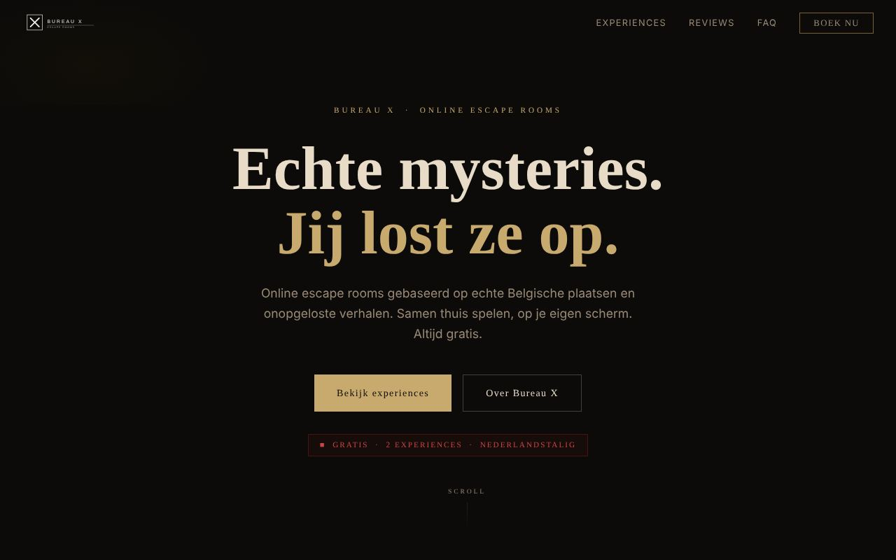
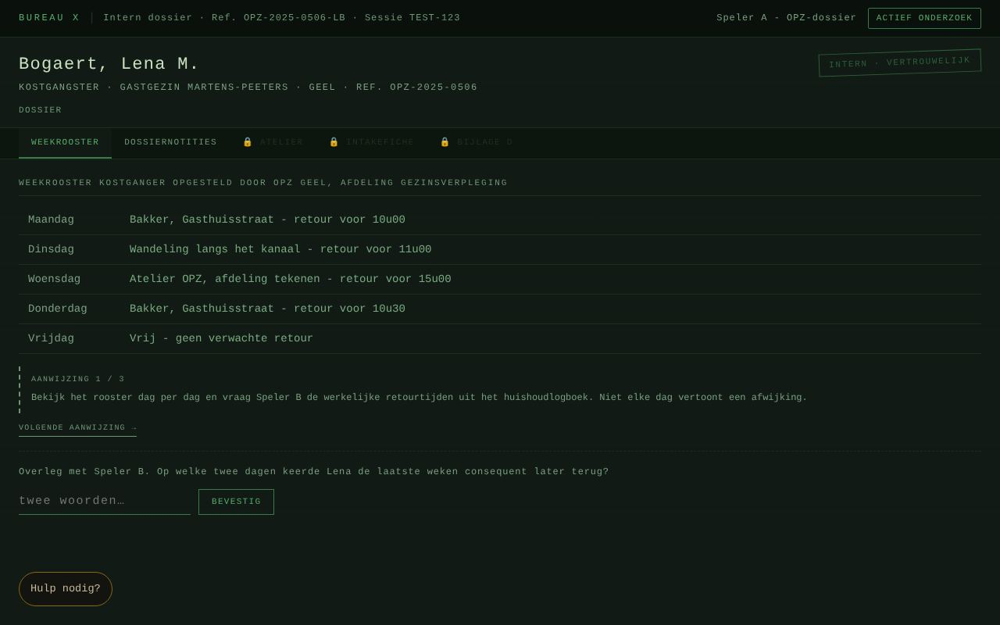
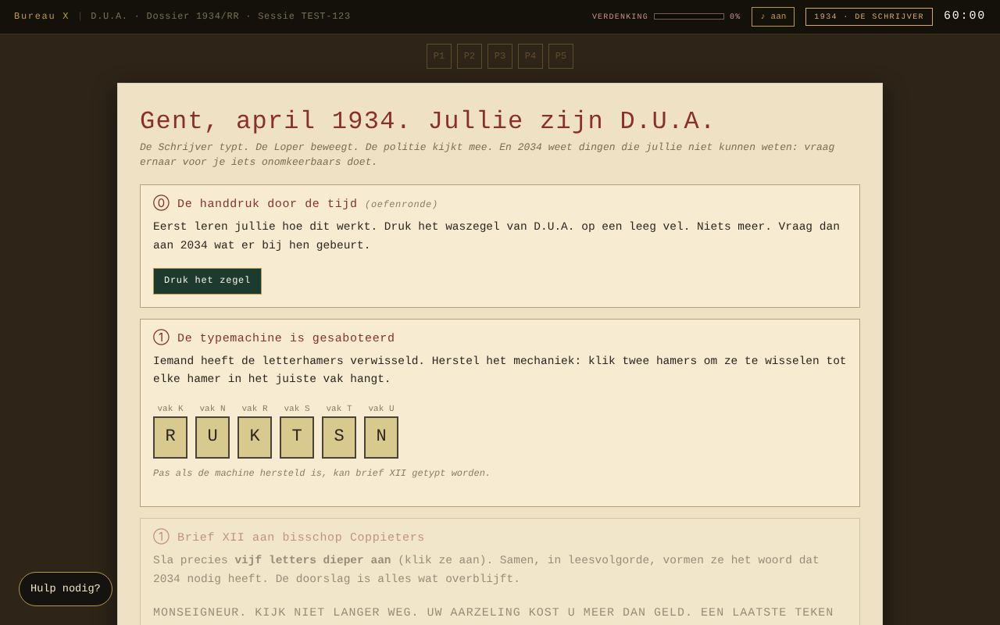
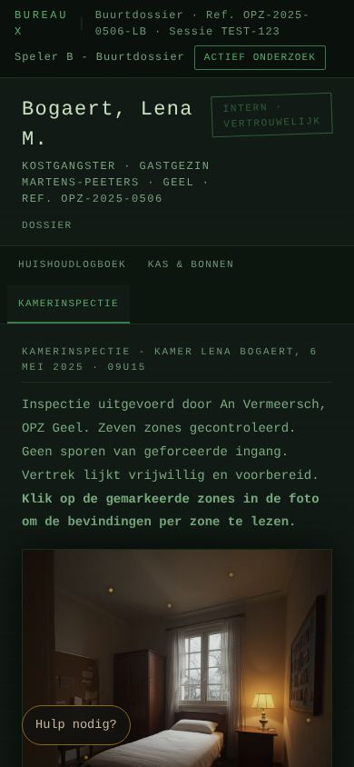

<div align="center">


**Online escape rooms voor twee tot vier spelers, elk op hun eigen scherm.**

[](https://github.com/xandermeyen/Escape-room/actions/workflows/ci.yml)
[](https://bureau-x.be)

</div>

Bureau X is een online escape room die je met z'n tweeën (of met vier) speelt, terwijl je
met elkaar belt. Elke speler krijgt een ander dossier en ziet dus andere stukken van het
verhaal. Geen enkele puzzel los je alleen op: je moet voorlezen, vergelijken en overleggen.

Ik bouwde dit naast mijn opleiding Graduaat Programmeren. Het draait live op
[bureau-x.be](https://bureau-x.be) en wordt gespeeld door echte groepen, die via een
boekingsformulier een sessiecode krijgen.

| Homepage                                      | Kamer 14, Speler A (met hint)                                             |
| --------------------------------------------- | ------------------------------------------------------------------------- |
|         |               |
| **D.U.A., het tijdperk 1934**                 | **Kamerinspectie op gsm (390 px)**                                        |
|  |  |

## De twee experiences

**Kamer 14** speelt zich af in Geel, rond de eeuwenoude gezinsverpleging. Kostgangster Lena
is verdwenen. Speler A heeft het dossier van het psychiatrisch centrum, Speler B het logboek
van het gastgezin en de kamer van Lena. Samen zoeken ze uit waar ze heen ging, bij wie, en
met welke bus. Vijf puzzels, 60 minuten, en een briefkaart als beloning.

**D.U.A.** gaat over de diefstal van _De Rechtvaardige Rechters_ in 1934. Eén kant speelt in
1934 en verstopt een spoor, de andere kant speelt in 2034 en vindt wat er een eeuw later van
over is. Wat 1934 verknoeit, merkt 2034 pas later. Twee tot vier spelers.

## Zelf proberen (demo)

Elke experience heeft een vaste demo-sessie, zodat je het spel alleen kan tonen:

- Kamer 14: [`DEMO-K14`](https://bureau-x.be/experiences/kamer-14/?sessie=DEMO-K14)
- D.U.A.: [`DEMO-DUA`](https://bureau-x.be/experiences/dua/?sessie=DEMO-DUA)

In demomodus staat bovenaan een balk om met één klik van rol te wisselen (Speler A en B, of
1934 en 2034). Demo-sessies tellen niet mee in de statistieken en bewaren geen reviews. De
host zet een demo vanuit het host-paneel met één knop terug naar het begin.

## Architectuur

```
Browser (Vite + TypeScript, statische pagina's)
   │  realtime sync, anonieme login
   ▼
Firebase Realtime Database + Firebase Auth + App Check (reCAPTCHA Enterprise)
   ▲
   │  sessie aanmaken (REST, ingelogd als beheerder)
Make.com  ◄── Formspree-boekingsformulier ── speler
```

| Onderdeel   | Keuze                                                                   |
| ----------- | ----------------------------------------------------------------------- |
| Frontend    | HTML, CSS, TypeScript (strict), Vite, Bootstrap 5                       |
| Backend     | Firebase Realtime Database, Firebase Auth (anoniem + e-mail/wachtwoord) |
| Beveiliging | Database-rules per veld, beheerders-lijst, Firebase App Check           |
| Hosting     | GitHub Pages met eigen domein, deploy via GitHub Actions                |
| Monitoring  | Sentry (alleen in productie)                                            |
| Analytics   | Google Analytics 4 met Consent Mode, pas na toestemming                 |
| Boekingen   | Formspree, Make.com, Combell SMTP                                       |
| Kwaliteit   | Vitest, ESLint, Prettier, html-validate, rules-tests met de emulator    |

Elke experience heeft dezelfde opbouw: een lobby (code en rol kiezen), een spelerpagina per
rol, een eindscherm met rapport en review, een tijd-voorbij-scherm en een host-paneel. De
gedeelde logica staat in `shared/js/` (sessies, timer, antwoordcontrole, speldata, hulp,
demomodus, host-onderdelen), de verhaalspecifieke teksten en configuratie in
`experiences/<naam>/js/`.

## Ontwerpkeuzes

**Gehashte antwoorden.** In de broncode staan geen antwoorden, alleen SHA-256-hashes. Wie de
ontwikkelaarstools opent, vindt niets bruikbaars. De oplossing voor het tijd-voorbij-scherm
staat gecodeerd in de bundel en verschijnt enkel als de sessie gesloten is.

**Normalisatie vóór het hashen.** Spelers typen "dinsdag en donderdag", "Di, Do" of
"donderdag dinsdag". Een normalisatiestap per puzzel maakt daar één vaste vorm van (dagen in
weekvolgorde, "vijf weken" wordt 5, "7u35" en "07.35" worden 07:35, "met de bus van De Lijn"
wordt een vervoermiddel), en pas die vorm wordt gehasht. Zo is de controle soepel zonder dat
er een antwoord in de code staat. Eén typfout in een naam mag ook: de varianten van de invoer
worden gehasht, niet die van het antwoord.

**Bijna-meldingen.** Een gedeeltelijk juist antwoord (één van de twee dagen, het juiste uur
met verkeerde minuten, de juiste plekken in de verkeerde volgorde) krijgt "Je zit dicht bij
het antwoord". Ook die controle gebeurt op hashes van de deelvormen.

**Nooit vastzitten.** Na twee mislukte pogingen licht de hintknop op. Na acht minuten zonder
voortgang verschijnt een korte verhaalmelding die richting geeft. Na elke opgeloste puzzel
staat er wat er vrijkwam en wat de andere speler nu heeft. De laatste hintstap is een sterke
duw, geen antwoord. En er is altijd een knop "Hulp nodig?".

**Database-rules als echte beveiliging.** Spelers loggen anoniem in. Ze mogen enkel bestaande
sessies aanpassen, en per veld enkel wat het spel nodig heeft: een puzzel van `false` naar
`true`, een rol één keer claimen, een rapport één keer indienen, tellers enkel met +1.
Aanmaken, resetten en alle sessies lezen kan alleen een beheerder uit `beheerders/<uid>`,
niet zomaar elk account met een wachtwoord. App Check weert verkeer dat niet van de site
komt. Zie [docs/beveiliging.md](docs/beveiliging.md).

**Speldata zonder persoonsgegevens.** Per puzzel worden de tijd, de foute en bijna-pogingen
en de gebruikte hintstappen bewaard, enkel gekoppeld aan de sessiecode. Het host-paneel toont
gemiddelden per puzzel en markeert de moeilijkste. Spelers zien op het eindscherm "sneller dan
X% van de groepen", op basis van een anonieme lijst met tijden die alleen een beheerder kan
schrijven.

**Eerlijke reviews.** Een lage score wordt gewoon bewaard. Bij 1 tot 3 sterren vraagt het
formulier kort wat beter kan; dat ziet alleen de host.

**Toestemming voor cookies.** Google Analytics laadt pas na "Accepteren" (Consent Mode v2).
Wie weigert, laadt het script helemaal niet.

**Toegankelijkheid.** Tabs, kamerzones, rolkaarten, de typemachine en de stadsplannen werken
met het toetsenbord (Tab, Enter/spatie, pijltjes, Escape). Kleuren halen minstens 4,5:1
contrast. Klikdoelen op gsm zijn minstens 44 px.

## Lighthouse

Gemeten met Lighthouse 12 (gsm-profiel, gesimuleerde vertraging) op de productiebuild via
`vite preview`. Firebase en Google Fonts waren in die testomgeving niet bereikbaar, wat de
"best practices" (consolefouten) iets drukt.

| Pagina            | Performance | Toegankelijkheid | Best practices | SEO |
| ----------------- | ----------- | ---------------- | -------------- | --- |
| Home              | 94          | 100              | 96             | 100 |
| Kamer 14 (info)   | 100         | 100              | 96             | 100 |
| Kamer 14 Speler A | 84          | 100              | 96             | 54  |

De spelerpagina's staan bewust op `noindex`; daar komt de lage SEO-score vandaan. Ook de
lobby's, de tweede spelerpagina, de eindschermen, alle D.U.A.-pagina's, het privacybeleid en
het host-paneel halen 100 op toegankelijkheid.

## Lokaal draaien

Je hebt Node 22+ en pnpm nodig.

```bash
pnpm install
cp .env.example .env.development   # vul je eigen Firebase-config in
pnpm dev                           # http://localhost:5173
```

| Commando            | Wat het doet                                            |
| ------------------- | ------------------------------------------------------- |
| `pnpm test`         | Vitest-unittests (jsdom)                                |
| `pnpm test:rules`   | Database-rules testen tegen de emulator (Java 21 nodig) |
| `pnpm lint`         | ESLint, met een regel tegen onveilige `innerHTML`       |
| `pnpm lint:html`    | Alle HTML-pagina's valideren                            |
| `pnpm format:check` | Prettier-controle                                       |
| `pnpm typecheck`    | TypeScript zonder build                                 |
| `pnpm build`        | Productiebuild naar `dist/`                             |

CI draait dit allemaal bij elke push. Een push naar `main` bouwt en deployt naar GitHub
Pages. De database-rules deploy je apart, met de handmatige workflow "Firebase rules
deployen".

## Meer documentatie

- [docs/beveiliging.md](docs/beveiliging.md): rules, beheerders, App Check en een testchecklist
- [docs/make-scenario.md](docs/make-scenario.md): de boekingsautomatisering in Make.com

---

Lena Bogaert is een fictief personage. De gezinsverpleging in Geel, de diefstal van
_De Rechtvaardige Rechters_ en de brieven van D.U.A. zijn echt.
